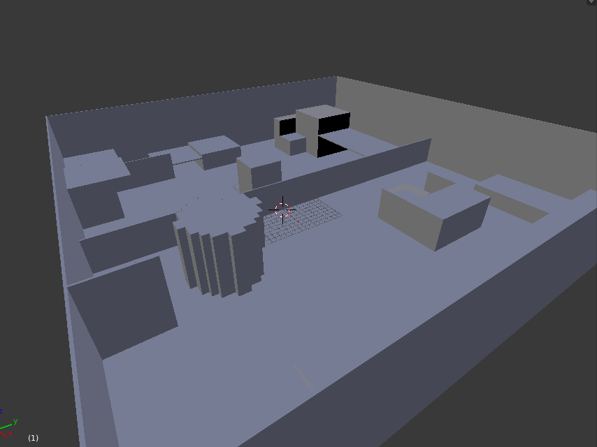
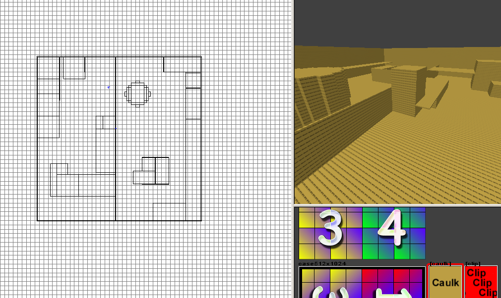

# simple-map2obj
A simple CoD map to Wavefront obj model converter. Only supports cubes (brushes with 6 faces only).
It can convert rotated brushes but be careful. It may mess 1 or 2 other brushes for don't know what reason.

## Usage
Put your **.map** file in `maps` folder and run obj-to-map.py.

## Preview

